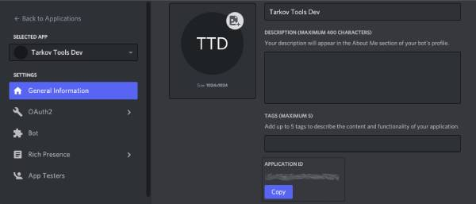
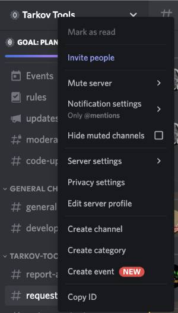
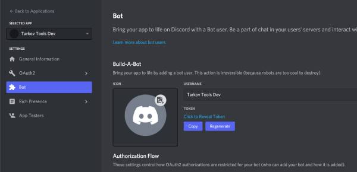

# Tarkov Tools Discord bot

This is the official [tarkov-tools](https://tarkov-tools.com) discord bot.

To add it to your server, just go here

https://discord.com/api/oauth2/authorize?client_id=925298399371231242&permissions=309237664832&scope=bot%20applications.commands

or here

https://discordbotlist.com/bots/tarkov-tools

https://top.gg/bot/925298399371231242

## Development
For development you need to crate 2 files in your local directory. One is for registering commands and one is for running the bot.

The files are `config-dev.json` & `.env`

First is `config-dev.json`

```
{
    "clientId": "",
    "guildId": "",
    "token": ""
}
```

## clientId

What your dev application has as "APPLICATION ID" https://discord.com/developers/applications/



## guildId

What discord server you want to run your bot during development




### How to enable developer mode
1. In Discord, open your User Settings by clicking the Settings Cog next to your user name on the bottom.
2. Go to Appearance and enable Developer Mode under the Advanced section, then close User Settings.
3. Open your Discord server, right-click on the server name, then select Copy ID


## token

The bot token your dev bot has gotten



The second file is `.env`

```
DISCORD_API_TOKEN=
ADMIN_ID=
```

DISCORD_API_TOKEN is the same as token above

ADMIN_ID is your client ID, to be used for admin commands.


To add the DEV bot to your server, click this link where you've replaced the MY_CLIENT_ID with your bots application id.
https://discord.com/api/oauth2/authorize?client_id=MY_CLIENT_ID&permissions=274877910080&scope=bot%20applications.commands


